## Databases Laboratory Work #2

## Database Creation and Maintenance Tools

### Objective:
  - Ability to work with database software

### Tasks:
1. Create a database physically placed in **MyDocuments** fixing an increase of the primary database file of 5MB with the 100MB increase limit 
and the 20MB log with the 1000MB increase limit. For secondary files, define a new Default Filegroup, setting the creation of 10MB with the 1000 MB increase limit.

2. Create a new database where the log file is physically placed in **MyDocuments\Log**. The name of *log* file, in the 
operating system environment, should be different from the log file defined in pshysical scheme. The new database should be 
compatible with *MS SQL Server 2017*. Also, the database should be accessible only for one user at a time.
  
3. Create the maintenance plan of the databse created in **1**. The unused space of database file should be removed when it reaches
the size of 2000MB. The released space should be returned to operating system. This process should be done every Friday at 2.00 AM.
The report of this maintenance plan should be saved in the **MyDocuments\SQL_reports** folder. Execute the maintenance plan. After
that, check the results in his folder.

4. Create the maintenance plan of the databse created in **2**. The name of the maintenance plan should be **_Rebuild index_**.
The system should do the rebuilding of indexes only on tables. The free space on page should be 10%. After rebuilding, must follow 
the update statistic of indexes. The third step of the plan represent the cleaning of Backup-Restore operations that took place 
on SQL server. Delete the history older than 6 weeks. This maintenance plan should be done every first Sunday of the month. The report
should be saved in the **MyDocuments\SQL_reports** folder. Execute the plan. Check the folder.

### Solutions:

#### For task nr.1:
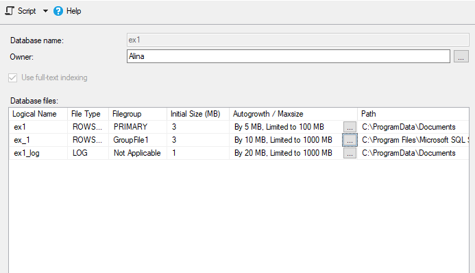

### For task nr.2:
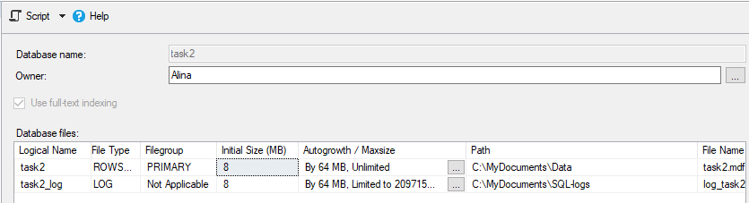
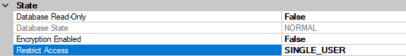

### For task nr.3:
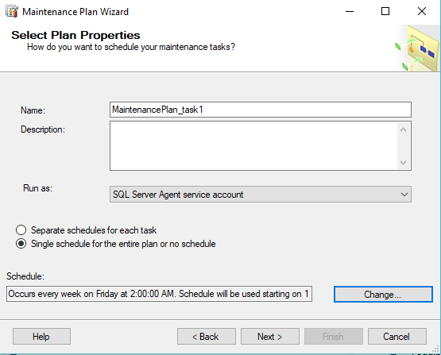
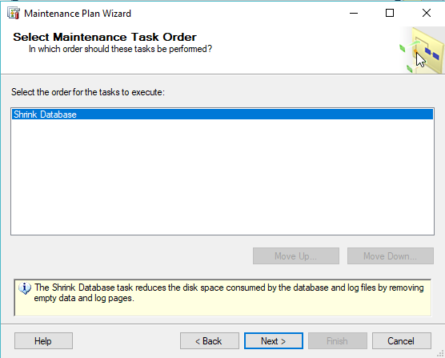
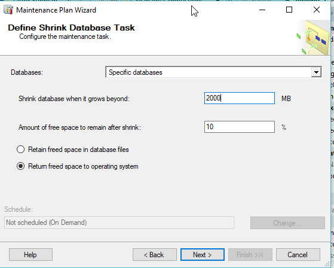
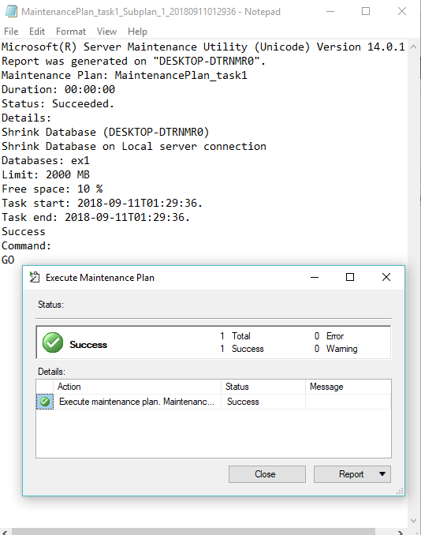

### For task nr.4:
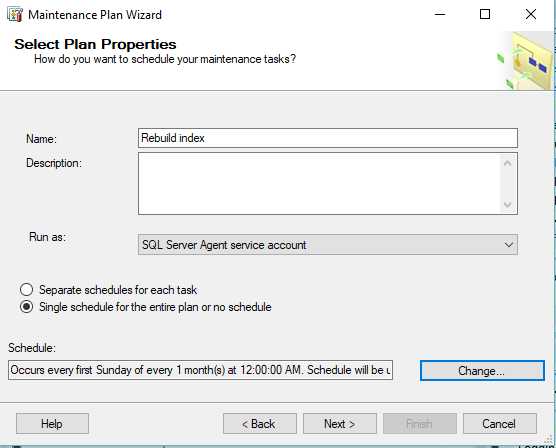
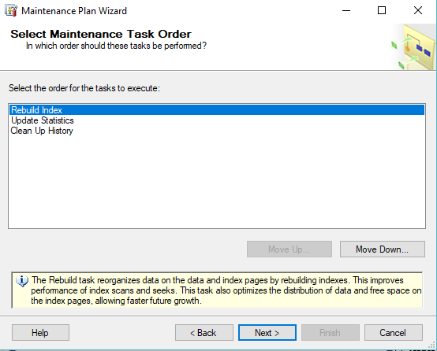
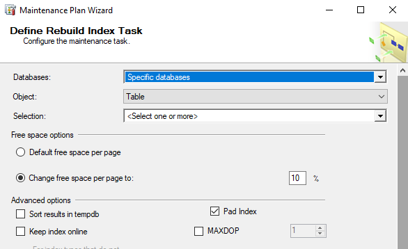
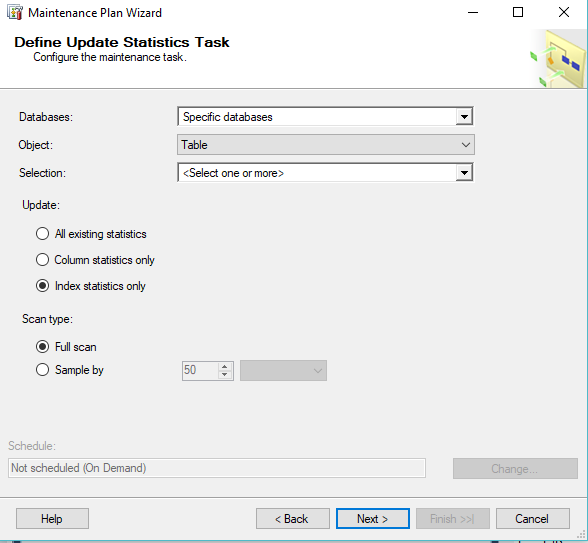
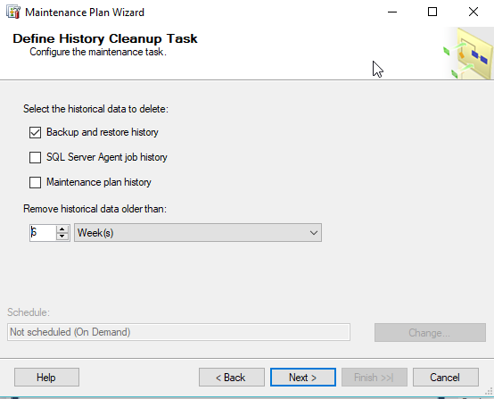
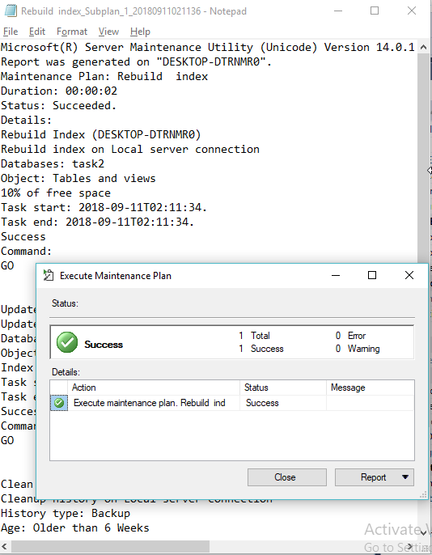
